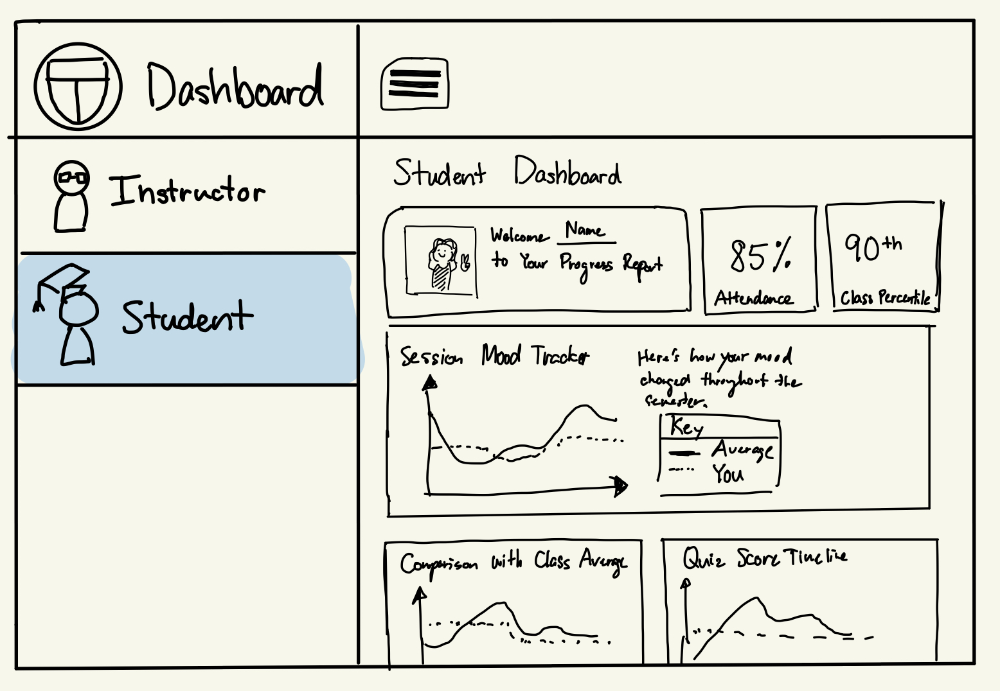
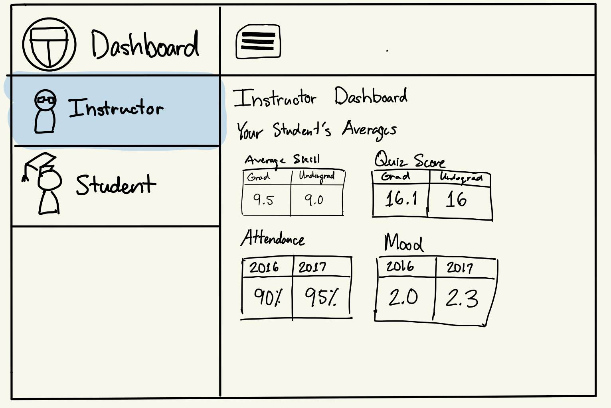

This project is about developing a learning analytics dashboard based on clicker data. You will work as a team to learn how to make a dashboard using R Shiny (official page with several tutorials: <https://shiny.rstudio.com/tutorial/>).

**Learning Objectives**

1.  Understand the structure of clicker data
2.  Create multiple different visualizations
3.  Design and implement an instructor and student dashboard
4.  Critically evaluate your own dashboard design

You are given aggregated clicker records for a CS course taught at Cornell. There are two datasets: the experience dataset and the quiz dataset.

**Scenario**

You are approached by a college instructor who uses iClickers in her CS class on Business Intelligence. She would like to gain insights about her students and how they are engaging/performing in order to better help them in class. She would also like to better support students by giving them feedback at scale about where they stand and perhaps how they compare to others in the class.

You offer to build a prototype of a dashboard using her clicker data: this is a dashboard for the instructor which offers an overview of the class characteristics, engagement, and performance; and it is a dashboard for students which offers a specific student an overview of their engagement and performance (and how it compares to others).

**Data**

The **experience dataset** contains one record per student who completed the CS course between 2016-2018. There are two sources to this dataset: Faculty Center and a Skills Survey (administered via the Blackboard LMS) where students self reported their skill level for various skills the first week of class. This data has been de-identified. Name, netid, emplid, major have all been removed and replaced with a unique numeric identifier. Note that not all students completed the skills survey, they will have null values for the survey result fields.

| Attribute Name | Data Type | Definition |
|------------------------|------------------------|------------------------|
| student_key | numeric Unique key | Assigned as part of de-identification process. Uniquely identifies student records for this data set only. |
| year | numeric | Four digit year student was enrolled in BI Class. |
| prog | character Values (GRAD, UGRAD) | Indicates whether the student was a graduate or undergraduate student when they were enrolled in BI course. |
| database_score | numeric (0-5) | Self reported experience level with database technology prior to taking course. 0= no experience, 5= expertise |
| sql_score | numeric (0-5) | Self reported experience level with SQL prior to taking course. 0= no experience, 5=expertise |
| programing_score | numeric (0-5) | Self reported experience level with Any Programing language prior to taking course. 0=no experience, 5=expertise |
| stored_proc_score | numeric (0-5) | Self reported experience level with stored procedure languages prior to taking course. 0=no experience, 5=expertise |
| etl_score | numeric (0-5) | Self reported experience level with Extract Transform Load (ETL) development prior to taking course. 0=no experience, 5=expertise |
| data_vis_score | numeric (0-5) | Self reported experience level using data visualization tools prior to taking course. 0=no experience, 5=expertise |
| requirement_gather_score | numeric (0-5) | Self reported experience level gathering customer requirements prior to taking course. 0=no experience, 5=expertise |
| skill_survey_score | numeric | Sum of the self reported skill level scores. |

The **quiz dataset** contains one record per student per class session held where iClickers were used. Sources used in the creation of this data set include: iClicker session xml files, Blackboard gradebook (for quiz scores), and the Blackboard class schedule (used to map iClicker session to related quiz scores). Note that in some cases there are multiple iClicker sessions / lectures associated with a single quiz. This dataset may be joined to the experience dataset by the student_key field.

| Attribute Name | Data Type | Definition |
|------------------------|------------------------|------------------------|
| Acad_date_key | numeric | Date key in the form of YYYYMMDD indicating the date the class session was held. |
| student_key | numeric | Unique identifier for students who took BI class 2016-2018. This key is the primary key for the experience_data file. |
| year | numeric | Four digit year class session was held. |
| session_number | numeric | Identifies the session number for a particular semester. Session number is assigned by iClicker. |
| quiz_number | numeric | There are 10 quizzes throughout the BI course. This attribute indicates which quiz is associated with the iClicker session(s). |
| attended | numeric (0,1) | Binary indicating whether the student attended that particular class session / lecture. 0=no, 1=yes. |
| total_possible_clicker | numeric | The total number of iClicker questions asked that session. |
| total_completed_clicker | numeric | The number of iClicker questions answered by student that session. |
| completed_q_clicker | numeric | The number of completed Quiz iClicker questions |
| correct_q_clicker | numeric | How many correct Quiz answers by student that session. |
| completed_t_clicker | number | How many Temperature questions answered by student that session. Temperature questions are 0-5, 0= bad, 5=great. There is no correct answer to Temperature questions, they are used to gauge how students are feeling about a particular subject, assignment, etc. |
| avg_t_clicker | number | The average temperature answer by student for that session. An average of 1 or 2 would be generally negative, while 4 or 5 would be generally positive responses. |
| quiz_score | numeric | Quiz score out of 20 points possible. |

```{r warning=FALSE, message=FALSE, echo=FALSE}

library(tidyverse)
library(shiny)
library(patchwork)
library(shinydashboard)

# This should load the datasets: 
# experience (123 by 11) and quiz (2423 by 13)
load("info4100.proj.dashboard.rda")

# Note: quiz returns (2429 by 13). No duplicates were identified after running "dim(quiz[duplicated(quiz$id),])[1]"

```

# Part 1: Planning / Sketching

Go through the planning / sketching process described in the reading about dashboards. While some dashboards are certainly better than others, there is not one correct solution here. However, spending enough time to make a concrete plan is essential for the success of your project. Everything you do to make the dashboards will be easier if you have a clear plan, especially because you will be splitting up the work and everyone needs to know what they should work on.

**Question 1:** You will make a student dashboard and a teacher dashboard. Carefully consider the implications of this for design and content. To plan, answer the following prompts once for the student dashboard and then for the teacher dashboard. The more concrete you are here the easier it will be later. Focus on the concrete ideas that you will implement in the next steps. You can iterate on this step and modify your responses as your ideas for the dashboard become clearer. You should explore the dataset in R for 5-10 minutes to get a good sense of what the dataset has to offer.

*Planning for the student dashboard*

-   For whom? Who will use it and what is their background?

    -   Primarily for students enrolled in the Business Intelligence course. These users are undergraduate or graduate students with varying technical backgrounds, some of whom may have limited experience in databases, SQL, or BI tools. They are familiar with iClicker-based participation and receive feedback via online platforms.
    -   Instructors may access Student View to assess student's understanding of their (the student's) progress.

-   Why? What is the goal? What questions to answer?

    -   To give personalized, actionable feedback on students' engagement and performance
    -   Help student self-assess, compare, and push them to take initiative
    -   Identify and notify students who are falling behind early — notification systems may be informed by low attendance, low quiz scores, or declining temperature scores
    -   Prompt reflection on learning confidence and performance trends over time

-   What? What data to show and what is its structure?

    -   [sum(attended) / total sessions to calculate attendance Rate]
    -   [sum(total_completed_clicker) / sum(total_possible_clicker) for Clicker Response Rate]
    -   [Percentile Ranking in Class: Quiz score percentile]
    -   [Line chart of quiz performance over time with overlay of avg_t_clicker for confidence tracking]
    -   [Skill Radar Chart: Self-reported skill levels compared to class average]

-   How? How will visualizations support the goal?

    Visualizations support this goal by:

    -   Providing a clear visual representation of attendance is dropping at certain points
    -   Highlighting which quizzes/topics need review based on student performance
    -   Communicating positive/negative learning trends to students by using score-over-time visualization with color-coded performance zones
    -   Displaying comparative context (e.g., class average) anonymously to help students interpret their standing without compromising peer privacy

*Planning for the teacher dashboard*

-   For whom? Who will use it and what is their background?
    -   Instructors of the Business Intelligence course at Cornell University
    -   They are experienced educators with interest in student analytics, likely familiar with concepts from BI, and looking for actionable insights to improve teaching and student success
-   Why? What is the goal? What questions to answer?
    -   To monitor overall class engagement, performance, and mood over time
    -   Identify students who are at risk (low attendance and low scores) for early intervention
    -   Understand which topics or sessions led to confusion (via temperature trends and quiz scores)
    -   Assess whether self-reported skill levels correlate with student outcomes
-   What? What data to show and what is its structure?
    -   Average attendance per session; quiz score distributions per session or per quiz
    -   Heatmaps or timelines of mood trends via [avg_t_clicker aggregated by session]
    -   Histograms or boxplots of self-reported skill scores, grouped by GRAD/UGRAD
    -   Interactive table of at-risk students (e.g., attendance \< 70%, avg quiz score \< 60%)]
    -   Correlation charts between skill_survey_score and engagement/performance metrics
-   How? How will visualizations support the goal?
    -   Using line charts and heatmaps to show trends across the semester in attendance, quiz performance, and mood—helping instructors identify when and where issues arise
    -   Using boxplots and bar charts to explore the distribution of skills and their relationship to success
    -   Providing interactive filters and sortable tables to easily find and support struggling students
    -   Grouping visualizations hierarchically (overview \> session detail \> individual student), supporting both broad and granular insights

**Question 2:** Based on your plan above, make a sketch of what the dashboard would look like. See this week's readings for examples. Be detailed about what kinds of data points and visualizations you want to see in different parts of the page. Consider the user experience and how you should position more general information compared to more specific information, and where you may need some additional explanation to help the viewer understand a graphic, for example. In your sketch, it is useful to give labels to different objects, because in the steps below you can split up work between team members and the labels will help you connect the UI with the data objects. Show your sketches in section to get feedback from the teaching team.

Each dashboard should contain at least 4 data visualizations. You may include any additional summary statistics (e.g. key percentages or tables).

## Student Dashboard Sketch



The top section introduces general statistics to the student. This would include their attendance rate and relative class percentile placement. Content includes:

-   A personal information header that includes a message with the student's name and key metrics

-   **`stud.attendanceRate`**: Attendance percentage with calendar icon

-   **`stud.percentileRank`**: Class percentile ranking with chart icon

-   **`stud.clickerRate`**: Clicker response rate with checkmark icon

-   **`stud.avgScore`**: Average quiz score with grade icon

The middle section is dedicated to tracking emotions, likely `` stud.moodTrend` `` and i**nst.avgMood.**

Lastly, the Bottom segments are dedicated to comparison of the student's performance alongside the class average and their quiz score along a timeline of the entire course.

The layout follows good UX principles by placing summary metrics at the top and more detailed visualizations below, with clear labeling and explanatory text to help students interpret the data.

## Teacher Dashboard Sketch



# Part 2: Dashboard Wire-frame Implementation

This is where you generate the dashboard layout. You are given a very basic wire frame example for the dashboard below. For more information on how R Shiny Dashboards work, look at <https://rstudio.github.io/shinydashboard/get_started.html> and <https://rstudio.github.io/shinydashboard/structure.html>. You can add different types of content into a `fuidRow()`. In the starter code, there are 2 rows of content: the first has two little info boxes; the second has two larger viz boxes. You can add more rows and change what is in them as you wish. Follow the naming convention, e.g. `inst.info1` is the first info box for instructors.

Your team can split up the tasks. Some work on creating the UI (this part), while others work on pre-processing the data and creating the statistics and visualizations that will populate the UI (next part).

**Question 3:** Create the layout for the dashboard tabs. You can have as many "tabs" as you like. Each tab is the content displayed when the user clicks on one of the menu items (so it is the page content). Here you are just specifying the wire frame i.e. **what goes where on the pages**, not what goes into it.

```{r}
#######################################
####### BEGIN INPUT: Question 3 #######

library(DT)

# Instructor Dashboard Tab
instructor_dash = tabItem(
  tabName = "instructor",
  h2("Instructor Dashboard"),

  # Top KPIs
  fluidRow(
    infoBoxOutput("inst.avgAttendance"),
    infoBoxOutput("inst.avgScore"),
    infoBoxOutput("inst.atRiskCount")
  ),

  # Session Trends
  fluidRow(
    box(
      title = "Attendance Over Time",
      plotOutput("inst.attendanceTrend", height = 300),
      width = 6
    ),
    box(
      title = "Mood (avg_t_clicker) Over Time",
      plotOutput("inst.moodTrend", height = 300),
      width = 6
    )
  ),

  # Performance and Risk Analysis
  fluidRow(
    box(
      title = "Quiz Score Distribution by Quiz Number",
      plotOutput("inst.quizDistribution", height = 300),
      width = 6
    ),
    box(
      title = "At-Risk Students",
      DT::dataTableOutput("inst.riskTable"),
      width = 6
    )
  )
)

# Student Dashboard Tab
student_dash = tabItem(
  tabName = "student",
  h2("Student Dashboard"),

  # Personal Summary
  fluidRow(
    infoBoxOutput("stud.percentileRank"),
    infoBoxOutput("stud.attendanceRate"),
    infoBoxOutput("stud.clickerRate")
  ),

  # Performance Over Time
  fluidRow(
    box(
      title = "Quiz Scores Over Time",
      plotOutput("stud.quizTrend", height = 300),
      width = 6
    ),
    box(
      title = "Mood Over Time",
      plotOutput("stud.moodTrend", height = 300),
      width = 6
    )
  ),

  # Skill Self-Assessment
  fluidRow(
    box(
      title = "Skill Radar Chart",
      plotOutput("stud.skillRadar", height = 300),
      width = 6
    ),
    box(
      title = "Class Average Comparison",
      plotOutput("stud.skillBar", height = 300),
      width = 6
    )
  )
)

#######################################
#######################################

```

# Part 3: Data Pre-processing

Get the data ready for use in the dashboard. Before the next stage, you want to have the data ready in the right format for simple computations and plotting. To do this effectively, you need to know by now what you want to display in each dashboard. However, this is also an iterative process. Once you have completed a first iteration of the design, you can come back to this step and add further pre-processing for more visualizations you like to add. This step is also an opportunity to better understand the structure of the datasets.

The instructor dashboard should show information for all students. The student dashboard is typically focused on an individual student. You can either pick a student (at random or intentionally) and use them as the "reference student" for the student dashboard. Or, a bit more ambitious but also more rewarding to try out, you can create an interactive dashboard in which you select the student and then the dashboard updates to show the information for that student. I would recommend you start with the simpler version and get that to work before you try to make it dynamic.

Use the space below to be ready for your information visualizations in the dashboards.

```{r}
#######################################
####### BEGIN INPUT             #######
#######################################

# ===============================
# 1. QUIZ Data Pre-processing
# ===============================

# Clean quiz dataset
quiz_clean <- quiz %>%
  filter(!is.na(QUIZ_NUMBER),
         !is.na(QUIZ_SCORE),  
         !is.na(ATTENDED)) %>%  
  mutate(
    ATTENDED = ifelse(ATTENDED %in% c(0,1), ATTENDED, NA),
    AVG_T_CLICKER = ifelse(AVG_T_CLICKER >= 0 & AVG_T_CLICKER <= 5, AVG_T_CLICKER, NA)
  ) %>%
  filter(!is.na(ATTENDED))   

# Quick session-level summary (for Instructor view later)
session_summary <- quiz_clean %>%
  group_by(YEAR, SESSION_NUMBER) %>%
  summarise(
    session_attendance_rate = mean(ATTENDED, na.rm = TRUE),
    avg_temperature = mean(AVG_T_CLICKER, na.rm = TRUE),
    avg_quiz_score = mean(QUIZ_SCORE, na.rm = TRUE),
    n_students = n(),
    .groups = 'drop' 
  )

# Quick student-level summary (for Student view later)
student_summary <- quiz_clean %>%
  group_by(STUDENT_KEY) %>%
  summarise(
    student_attendance_rate = mean(ATTENDED, na.rm = TRUE),
    clicker_response_rate = sum(TOTAL_COMPLETED_CLICKER, na.rm = TRUE) / 
                             sum(TOTAL_POSSIBLE_CLICKER, na.rm = TRUE),
    correct_answer_rate = sum(CORRECT_Q_CLICKER, na.rm = TRUE) / 
                          sum(COMPLETED_Q_CLICKER, na.rm = TRUE),
    avg_quiz_score = mean(QUIZ_SCORE, na.rm = TRUE),
    total_sessions = n()
  )

# ===============================
# 2. EXPERIENCE Data Pre-processing
# ===============================

# Clean experience dataset and include all skill-related fields
experience_clean <- experience %>%
  select(
    STUDENT_KEY,
    PROG,
    DATABASE_SCORE,
    SQL_SCORE,
    PROGRAMING_SCORE,
    STORED_PROC_SCORE,
    ETL_SCORE,
    DATA_VIS_SCORE,
    REQUIREMENT_GATHER_SCORE,
    SKILL_SURVEY_SCORE
  ) %>%
  mutate(across(
    c(DATABASE_SCORE, SQL_SCORE, PROGRAMING_SCORE, STORED_PROC_SCORE,
      ETL_SCORE, DATA_VIS_SCORE, REQUIREMENT_GATHER_SCORE, SKILL_SURVEY_SCORE),
    ~ ifelse(is.na(.x), 0, .x)
  ))

# Merge experience skill level into student summary
student_full_summary <- student_summary %>%
  left_join(experience_clean, by = "STUDENT_KEY")

# Calculate class-wide skill averages for comparison visualizations
skill_averages <- experience_clean %>%
  summarise(across(
    c(DATABASE_SCORE, SQL_SCORE, PROGRAMING_SCORE, STORED_PROC_SCORE,
      ETL_SCORE, DATA_VIS_SCORE, REQUIREMENT_GATHER_SCORE),
    ~ round(mean(.x, na.rm = TRUE), 2)
  )) %>%
  mutate(Source = "Class Average") %>%
  relocate(Source)

# ========== SAVE FOR SHINY ==========
saveRDS(session_summary, "session_summary.rds")
saveRDS(student_full_summary, "student_full_summary.rds")

#######################################
#######################################
```

# Part 4: Prepare All Data Visualizations

This is where you create the content for the wire frames you created above. Again, you can refer to the examples and documentation in <https://rstudio.github.io/shinydashboard/get_started.html> and <https://rstudio.github.io/shinydashboard/structure.html> for guidance. You can also find many examples online just by searching with Google.

**Question 4:** For each of the pieces of content you planned for in the wire frames above, generate the relevant content. You need to assign them all to the `output` variable by referencing the name of the wire frame element you chose above like this `output$name.of.element`.

```{r}
server = function(input, output) {
    
#######################################
####### BEGIN INPUT: Question 4 #######
#######################################
    
    output$inst.info1 = renderInfoBox({
        infoBox("Students total", 
                length(unique(quiz$STUDENT_KEY)), 
                icon = icon("list"), color = "purple")
    })
    
    output$inst.info2 = renderInfoBox({
        infoBox("Attendance",
                paste0(round(100 * mean(quiz$ATTENDED)), "%"), 
                icon = icon("list"), color = "yellow")
    })
    
    output$inst.plot1 = renderPlot({
        hist(quiz$QUIZ_SCORE)
    })
    
    output$inst.plot2 = renderPlot({
        # I'm giving you three examples here
        # only the last one will be displayed
        # but you can try out each one.
        # As you can see, using ggplot allows you to 
        # make much better-looking visualizations.
      
        # simple
        hist(quiz$TOTAL_COMPLETED_CLICKER) 
      
        # using ggplot
        ggplot(quiz, aes(TOTAL_COMPLETED_CLICKER)) + 
          geom_histogram()
        
        # using ggplot to make it clearer
        ggplot(quiz, aes(x = TOTAL_COMPLETED_CLICKER)) + 
          geom_density(fill="gray") + # makes the density line and gray fill
          labs(x = "Completed Clicker Questions", y = "Density") + # change axis labels
          theme_classic() # to use white background
    })
    
#######################################
#######################################
    
}
```

```{r}
library(shiny)
library(shinydashboard)
library(tidyverse)
library(patchwork)

ui <- dashboardPage(
  dashboardHeader(title = "Student Dashboard"),

  dashboardSidebar(
    sidebarMenu(
      menuItem("General Dashboard", tabName = "main", icon = icon("dashboard")),
      menuItem("Session Mood Tracker", tabName = "mood", icon = icon("smile")),
      menuItem("Quiz Score Timeline", tabName = "quiz", icon = icon("chart-line")),
      menuItem("Comparison with Class Average", tabName = "comparison", icon = icon("balance-scale"))
    )
  ),

  dashboardBody(
    tags$head(
      tags$style(HTML("
        h2 {
          text-align: center;
          font-weight: semi-bold;
          padding-top: 0px;
          padding-bottom: 30px;
        }
      "))
    ),

    tabItems(
      tabItem(
        tabName = "main",
        h2("General Dashboard Overview"),
        fluidRow(
          valueBoxOutput("attendance_box", width = 3),
          valueBoxOutput("clicker_box", width = 3),
          valueBoxOutput("correct_box", width = 3),
          valueBoxOutput("percentile_box", width = 3)
        ),
        fluidRow(
          box(title = "Session Mood Tracker", width = 12, plotOutput("mood_plot_main", height = 300))
        ),
        fluidRow(
          box(title = "Quiz Score Timeline", width = 12, plotOutput("quiz_plot_main", height = 300))
        ),
        fluidRow(
          box(title = "Comparison with Class Average", width = 12, plotOutput("compare_plot_main", height = 300))
        ),
        fluidRow(
          box(title = "Actionable Feedback", width = 12, textOutput("feedback_text"))
        )
      ),
      tabItem(tabName = "mood", h2("Session Mood Tracker"), plotOutput("mood_plot")),
      tabItem(tabName = "quiz", h2("Quiz Score Timeline"), plotOutput("quiz_plot")),
      tabItem(tabName = "comparison", h2("Comparison with Class Average"), plotOutput("compare_plot"))
    )
  )
)

server <- function(input, output) {
  # Data Preparation
  student_dash <- quiz_clean %>% filter(STUDENT_KEY == 8)

  attendance_rate <- mean(student_dash$ATTENDED, na.rm = TRUE)
  clicker_response_rate <- if (sum(student_dash$TOTAL_POSSIBLE_CLICKER, na.rm = TRUE) == 0) NA else
    sum(student_dash$TOTAL_COMPLETED_CLICKER, na.rm = TRUE) / sum(student_dash$TOTAL_POSSIBLE_CLICKER, na.rm = TRUE)
  correct_answer_rate <- if (sum(student_dash$COMPLETED_Q_CLICKER, na.rm = TRUE) == 0) NA else
    sum(student_dash$CORRECT_Q_CLICKER, na.rm = TRUE) / sum(student_dash$COMPLETED_Q_CLICKER, na.rm = TRUE)

  class_avg <- quiz_clean %>%
    group_by(QUIZ_NUMBER) %>%
    summarise(CLASS_AVG_SCORE = mean(QUIZ_SCORE, na.rm = TRUE), .groups = 'drop')

  # Peer Percentile
  overall_score <- mean(student_dash$QUIZ_SCORE, na.rm = TRUE)
  all_student_scores <- quiz_clean %>%
    group_by(STUDENT_KEY) %>%
    summarise(AVG_SCORE = mean(QUIZ_SCORE, na.rm = TRUE), .groups = 'drop')
  peer_percentile <- ecdf(all_student_scores$AVG_SCORE)(overall_score) * 100

  # Feedback Message
  feedback <- if (correct_answer_rate < 0.5) {
    "Your correct answer rate is low. Review questions you got wrong and consider attending office hours."
  } else if (clicker_response_rate < 0.5) {
    "Try to engage more with clicker questions during sessions to improve participation."
  } else {
    "You're doing well across key metrics! Keep up the consistency."
  }

  # Plot Functions
  mood_plot_func <- function() {
    student_with_class <- student_dash %>%
      filter(ATTENDED == 1) %>%
      arrange(SESSION_NUMBER) %>%
      left_join(session_summary %>% select(SESSION_NUMBER, avg_temperature), by = "SESSION_NUMBER")

    ggplot(student_with_class, aes(x = SESSION_NUMBER)) +
      geom_line(aes(y = AVG_T_CLICKER, color = "Student Mood"), linewidth = 1) +
      geom_line(aes(y = avg_temperature, color = "Class Average"), linewidth = 1, linetype = "dashed") +
      geom_point(aes(y = AVG_T_CLICKER, color = "Student Mood")) +
      labs(title = "Session Mood Tracker vs Class Average", x = "Session Number", y = "Average Mood (0–5)", color = "Legend") +
      scale_color_manual(values = c("Student Mood" = "blue", "Class Average" = "red")) +
      theme_minimal()
  }

  quiz_plot_func <- function() {
    student_with_avg <- student_dash %>%
      arrange(ACAD_DATE_KEY) %>%
      left_join(class_avg, by = "QUIZ_NUMBER") %>%
      mutate(ACAD_DATE_KEY = as.Date(as.character(ACAD_DATE_KEY), format = "%Y%m%d"))

    ggplot(student_with_avg, aes(x = ACAD_DATE_KEY)) +
      geom_line(aes(y = QUIZ_SCORE, color = "Student Score"), linewidth = 1) +
      geom_line(aes(y = CLASS_AVG_SCORE, color = "Class Average"), linewidth = 1, linetype = "dashed") +
      geom_point(aes(y = QUIZ_SCORE, color = "Student Score")) +
      labs(title = "Quiz Score Timeline vs Class Average", x = "Academic Date", y = "Quiz Score (out of 20)", color = "Legend") +
      scale_color_manual(values = c("Student Score" = "blue", "Class Average" = "red")) +
      theme_minimal()
  }

  compare_plot_func <- function() {
    student_vs_class <- student_dash %>%
      select(QUIZ_NUMBER, QUIZ_SCORE) %>%
      left_join(class_avg, by = "QUIZ_NUMBER")

    ggplot(student_vs_class, aes(x = QUIZ_NUMBER)) +
      geom_line(aes(y = QUIZ_SCORE, color = "Student Score"), linewidth = 1.2) +
      geom_line(aes(y = CLASS_AVG_SCORE, color = "Class Average"), linewidth = 1.2, linetype = "dashed") +
      scale_color_manual(values = c("Student Score" = "blue", "Class Average" = "red")) +
      labs(title = "Comparison with Class Average", x = "Quiz Number", y = "Quiz Score (out of 20)", color = "Legend") +
      theme_minimal()
  }

  # Render Plots (Main and Tab Views)
  output$mood_plot_main <- renderPlot({ mood_plot_func() })
  output$quiz_plot_main <- renderPlot({ quiz_plot_func() })
  output$compare_plot_main <- renderPlot({ compare_plot_func() })
  output$mood_plot <- renderPlot({ mood_plot_func() })
  output$quiz_plot <- renderPlot({ quiz_plot_func() })
  output$compare_plot <- renderPlot({ compare_plot_func() })

  # Render Value Boxes
  output$attendance_box <- renderValueBox({
    valueBox(paste0(round(attendance_rate * 100, 1), "%"), "Attendance Rate", icon = icon("calendar-check"), color = "aqua")
  })

  output$clicker_box <- renderValueBox({
    valueBox(paste0(round(clicker_response_rate * 100, 1), "%"), "Clicker Response Rate", icon = icon("reply"), color = "light-blue")
  })

  output$correct_box <- renderValueBox({
    valueBox(paste0(round(correct_answer_rate * 100, 1), "%"), "Correct Answer Rate", icon = icon("check-circle"), color = "blue")
  })

  output$percentile_box <- renderValueBox({
    valueBox(paste0(round(peer_percentile, 1), "th"), "Your Class Percentile", icon = icon("user-graduate"), color = "yellow")
  })

  # Render Feedback Text
  output$feedback_text <- renderText({ feedback })
}

shinyApp(ui, server)

  
# ===== Run the App =====
shinyApp(ui = ui, server = server)


```

```{r}

library(shiny)
library(shinydashboard)
library(tidyverse)
library(DT)


# UI
ui <- dashboardPage(
  dashboardHeader(title = "Instructor Dashboard"),
  
  dashboardSidebar(
    sidebarMenu(
      menuItem("KPI Overview", tabName = "overview", icon = icon("dashboard")),
      menuItem("Skill Survey Breakdown", tabName = "skills", icon = icon("bar-chart")),
      menuItem("Quiz Score Trend", tabName = "quiz_trend", icon = icon("chart-line")),
      menuItem("Session Attendance Rate", tabName = "session_att", icon = icon("calendar-check")),
      menuItem("Session Mood Rate", tabName = "session_mood", icon = icon("smile")),
      menuItem("Student Performance", tabName = "performance", icon = icon("chart-line"))
    )
  ),
  
  dashboardBody(
    tabItems(
      tabItem(
        tabName = "overview",
        h2("Instructor Dashboard KPIs"),
        fluidRow(
          valueBoxOutput("skill_grad"),
          valueBoxOutput("skill_ugrad"),
          valueBoxOutput("quiz_grad")
        ),
        fluidRow(
          valueBoxOutput("att_by_year"),
          valueBoxOutput("mood_by_year"),
          valueBoxOutput("quiz_ugrad")
        )
      ),
      
      tabItem(
        tabName = "skills",
        h2("Skill Survey Score by Program"),
        box(title = "Skill Survey Score Distribution", width = 12, plotOutput("skill_plot"))
      ),
      
      tabItem(
        tabName = "quiz_trend",
        h2("Quiz Score Trend by Year"),
        box(title = "Trend of Quiz Scores", width = 12, plotOutput("quiz_score_trend_plot"))
      ),
      
      tabItem(
        tabName = "session_att",
        h2("Session Attendance Over Time"),
        box(title = "Session Attendance Rate by Session Number", width = 12, plotOutput("session_att_plot"))
      ),
      
      tabItem(
        tabName = "session_mood",
        h2("Session Mood Over Time"),
        box(title = "Average Temperature Responses", width = 12, plotOutput("session_mood_plot"))
      ),
      
      tabItem(
        tabName = "performance",
        h2("Student Quiz Performance"),
        sliderInput("score_threshold", "Highlight students below score:", min = 0, max = 20, value = 5),
        verbatimTextOutput("student_count"),
        box(title = "Quiz Score vs Attendance", width = 12, plotOutput("performance_plot"))
      )
    )
  )
)

# Server
server <- function(input, output) {
  
  # Join PROG into student_summary
  student_summary <- student_summary |>
    left_join(experience |> select(STUDENT_KEY, PROG), by = "STUDENT_KEY")
  
  # KPIs
  output$skill_grad <- renderValueBox({
    avg <- experience |> filter(PROG == "GRAD") |>
      summarise(m = mean(SKILL_SURVEY_SCORE, na.rm = TRUE)) |> pull(m)
    valueBox(round(avg, 1), "Avg Skill Score (GRAD)", icon = icon("user-graduate"), color = "purple")
  })
  
  output$skill_ugrad <- renderValueBox({
    avg <- experience |> filter(PROG == "UGRAD") |>
      summarise(m = mean(SKILL_SURVEY_SCORE, na.rm = TRUE)) |> pull(m)
    valueBox(round(avg, 1), "Avg Skill Score (UGRAD)", icon = icon("user"), color = "light-blue")
  })
  
  output$quiz_grad <- renderValueBox({
    avg <- student_summary |> filter(PROG == "GRAD") |>
      summarise(m = mean(avg_quiz_score, na.rm = TRUE)) |> pull(m)
    valueBox(round(avg, 1), "Avg Quiz Score (GRAD)", icon = icon("user-graduate"), color = "purple")
  })
  
  output$quiz_ugrad <- renderValueBox({
    avg <- student_summary |> filter(PROG == "UGRAD") |>
      summarise(m = mean(avg_quiz_score, na.rm = TRUE)) |> pull(m)
    valueBox(round(avg, 1), "Avg Quiz Score (UGRAD)", icon = icon("user"), color = "blue")
  })
  
  output$att_by_year <- renderValueBox({
    avg_att <- session_summary |>
      group_by(YEAR) |>
      summarise(att = mean(session_attendance_rate, na.rm = TRUE)) |>
      summarise(msg = paste(YEAR, ":", round(att * 100, 1), "%", collapse = " | ")) |> 
      pull(msg)
    valueBox(avg_att, "Avg Attendance Rate by Year", icon = icon("calendar-check"), color = "aqua")
  })
  
  output$mood_by_year <- renderValueBox({
    avg_mood <- session_summary |>
      group_by(YEAR) |>
      summarise(mood = mean(avg_temperature, na.rm = TRUE)) |>
      summarise(msg = paste(YEAR, ":", round(mood, 1), collapse = " | ")) |> 
      pull(msg)
    valueBox(avg_mood, "Avg Mood by Year", icon = icon("smile"), color = "orange")
  })
  
  # Skill Survey
  output$skill_plot <- renderPlot({
    ggplot(experience, aes(x = PROG, y = SKILL_SURVEY_SCORE, fill = PROG)) +
      geom_boxplot() +
      labs(title = "Skill Survey Score by Program", x = "Program", y = "Skill Survey Score") +
      theme_minimal()
  })
  
  # Quiz Score Trend
  output$quiz_score_trend_plot <- renderPlot({
    ggplot(session_summary, aes(x = SESSION_NUMBER, y = avg_quiz_score, color = as.factor(YEAR))) +
      geom_line(size = 1.2) +
      geom_point() +
      facet_wrap(~ YEAR) +
      labs(title = "Quiz Score Trend by Year", x = "Session Number", y = "Average Quiz Score", color = "Year") +
      theme_minimal()
  })
  
  # Attendance Over Time
  output$session_att_plot <- renderPlot({
    ggplot(session_summary, aes(x = SESSION_NUMBER, y = session_attendance_rate, group = YEAR, color = as.factor(YEAR))) +
      geom_line(size = 1.2) +
      geom_point() +
      labs(title = "Session Attendance Rate Over Time", x = "Session Number", y = "Attendance Rate", color = "Year") +
      theme_minimal()
  })
  
  # Mood Over Time
  output$session_mood_plot <- renderPlot({
    ggplot(session_summary, aes(x = SESSION_NUMBER, y = avg_temperature, group = YEAR, color = as.factor(YEAR))) +
      geom_line(size = 1.2) +
      geom_point() +
      labs(title = "Average Mood Over Time", x = "Session Number", y = "Average Mood", color = "Year") +
      theme_minimal()
  })
  
  # Student Performance Scatter Plot 
  output$performance_plot <- renderPlot({
    req(input$score_threshold)
    req("PROG" %in% colnames(student_summary))
    
    df <- student_summary |>
      filter(!is.na(avg_quiz_score), !is.na(student_attendance_rate), !is.na(PROG))
    
    if (nrow(df) == 0) return(NULL)
    
    ggplot(df, aes(x = student_attendance_rate, y = avg_quiz_score, color = factor(PROG))) +
      geom_point(size = 3, alpha = 0.8) +
      geom_hline(yintercept = input$score_threshold, linetype = "dashed", color = "red") +
      labs(
        title = "Student Quiz Performance by Attendance",
        x = "Attendance Rate",
        y = "Average Quiz Score",
        color = "Program"
      ) +
      theme_minimal()
  })
  
  output$student_count <- renderText({
    df <- student_summary |>
      filter(!is.na(avg_quiz_score), avg_quiz_score < input$score_threshold)
    paste("Total students below threshold:", nrow(df))
  })
}

# Run the app
shinyApp(ui = ui, server = server)

```

# Part 5: Produce Dashboard and Reflect

You should be able to simply run the code below **as is** to see your dashboard.

**Note:** Unfortunately, you cannot knit this part into a pdf. So I added `eval=FALSE` to let the knitting run smoothly and you can submit your PDF.

```{r eval=FALSE}
#######################################
### This code creates the dashboard ###
#######################################

# Here we set up the Header of the dashboard
dhead = dashboardHeader(title = "Clicker Dashboard")

# Here set up the sidebar which has links to two pages
dside = dashboardSidebar(
  sidebarMenu(
    menuItem("Instructor View", tabName = "instructor", icon = icon("dashboard")),
    menuItem("Student View", tabName = "student", icon = icon("th"))
  )
)

# Here we set up the body of the dashboard
dbody = dashboardBody(
    tabItems(
      student_dash,
      instructor_dash
    )
)

# Combining header, sidebar, and body
ui = dashboardPage(dhead, dside, dbody)

# Generating a local instance of your dashboard
shinyApp(ui, server)
```

**Question 5:** Add screenshots of your group's dahsboards below using this syntax or simply add them to the Word document after knitting:


**Question 6:** Evaluate your group dashboard from the perspective of the instructor (teacher dashboard) and from the perspective of the student (student dashboard). What do you like about it, what would you change or add to it if you had more time?

*Reflection for the student dashboard*

-   What do you like about it?
    -   I like how simple the dashboard is, and how clearly it shows the student’s current status compared to the overall class. This kind of visual feedback can really encourage students to improve and stay motivated. [jy965]
-   What would you change or add to it if you had more time?
    -   I’d love to explore the relationship between students’ mood and their quiz outcomes. By visualizing how emotional states align with performance, students can better understand how their well-being impacts learning. This can help them recognize when they’re going through a difficult time and take steps to manage stress or seek support.[jy965]
-   What was the biggest challenge you faced? How did you address it?
    -   When students have enough time to reflect, we can also uncover specific features that cater more directly to their needs. For example, by analyzing performance trends and mood data, we might be able to gauge how difficult certain chapters or lectures are. This could help students identify pain points in the curriculum and offer targeted support where it’s most needed.[jy965]

*Reflection for the teacher dashboard*

-   What do you like about it?
    -   [add your answer here]
-   What would you change or add to it if you had more time?
    -   [add your answer here]
-   What was the biggest challenge you faced? How did you address it?
    -   [add your answer here]

# Self-reflection

**Briefly summarize your experience on this homework. What was easy, what was hard, what did you learn?**

-   Insert your self-reflection here; it is used to improve the homework and course materials.

# Estimate time spent

**We want to give students an estimate of how much time this homework will take. Please indicate how many hours you spent to complete this homework here.**

-   I spent [insert your time] hours.

# Generative AI usage

**As stated in the course syllabus, using generative AI is allowed to help you as you complete this homework. We are interested in how it is being used and whether it is helpful for you.**

-   How much did you use generative AI (e.g., not at all, some, most, or all the questions) and which one did you use?
-   If you used generative AI, how did you use it and was it helpful?

# Submit Homework

This is the end of the homework. Please **Knit to Word** (if you run into an issue, you can knit to PDF). The resulting file has to show both the R code and R output. Upload it on Canvas before the due date.
